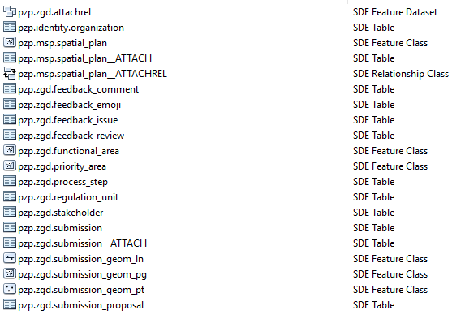
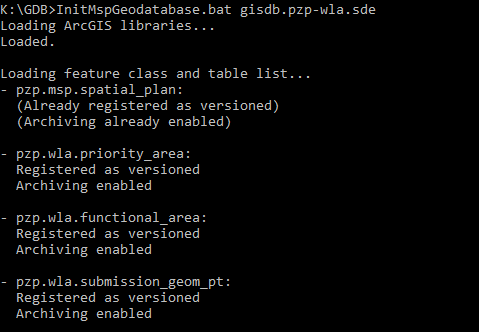

# Inicjalizacja Geobazy PZP POM

## Importowanie struktury bazy danych

## Konfiguracja wersjonowania oraz archiwizacji

Uruchom skrypt [InitMspGeodatabase.bat](InitMspGeodatabase.bat) jako pierwszy parametr podając ścieżkę do połączenia z Geobazą (*.sde). 

Zamiast użyć linii komend możesz przeciągnąć i upuścić plik *.sde na skrypt [InitMspGeodatabase.bat](InitMspGeodatabase.bat).

